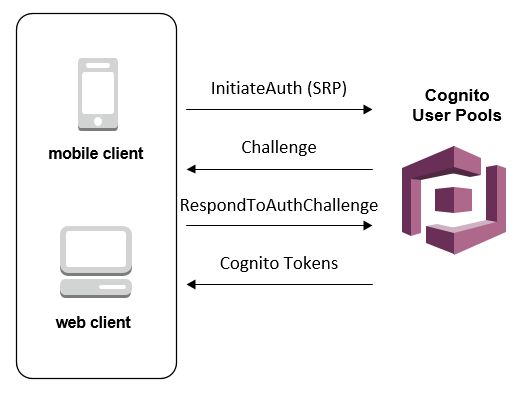

# aws-cognito-authentication-s3

`aws-cognito-authentication-s3` demonstrates the creation of an [AWS Cognito](https://aws.amazon.com/cognito/) User Pool, User Pool Client and Identity Pool.

Additionally, the project creates an S3 Bucket with per AWS Cognito username prefixes and permissions per prefix restricted to individual AWS Cognito users.

The project is based on the parent project [cognito-s3-cloudformation-example](https://github.com/franzwong/cognito-s3-cloudformation-example) as created by [Franz Wong](https://github.com/franzwong).

# Architecture

The project architecture is shown below.


The authentication flow of AWS Cognito is provided below. In the context of the `aws-cognito-authentication-s3` project, the *Login provider* is the [Cognito Identity Pool](https://docs.aws.amazon.com/cognito/latest/developerguide/cognito-user-identity-pools.html).


The interaction with the Cognito User Pools is shown in the diagram below.



# Prerequisites

* An AWS account with appropriate permissions to create the required resources
* [AWS CLI installed and configured](https://docs.aws.amazon.com/cli/latest/userguide/install-cliv1.html)
* [Node.js](https://nodejs.org/en/) (v12+) and [npm](https://www.npmjs.com/) (v6+) installed and [configured for use with AWS](https://docs.aws.amazon.com/sdk-for-javascript/v2/developer-guide/getting-started-nodejs.html)
* Bash environment in which to execute the scripts

# Deploy the project

## Grab the project 

The first step is to git clone the project.

```bash
git clone --verbose --progress https://github.com/damianmcdonald/aws-cognito-authentication-s3 aws-cognito-authentication-s3
```

## Configure global variables

The second step is to modify any of the global variables to suit your needs.

The global variables are defined in the [aws-deploy.sh](aws-deploy.sh) script.

You will need to update the `AWS_PROFILE` variable to reflect the profile that you have configured in the AWS CLI.

For the remaining global variables, if you just want to have a sandbox environment to experiment with the project then the defaults below are probably fine.

```bash
# Global variable declarations
PROJECT_DIR=$PWD
AWS_PROFILE=<!-- ADD_YOUR_AWS_CLI_PROFILE_HERE -->
AWS_REGION=$(aws configure get region --output text --profile ${AWS_PROFILE})
IAM_CAPABILITIES=CAPABILITY_NAMED_IAM
STACK_NAME=cognito-with-s3
CFN_STACK_TEMPLATE=stack-template.yml
USER_POOL_NAME=cognito-with-s3-user-pool
IDENTITY_POOL_NAME=cognito-with-s3-identity-pool
USER_ROLE_NAME=cognito-with-s3-role
USER_POLICY_NAME=cognito-with-s3-policy
ALLOWED_ORIGINS='"*"'
WEBPACK_CONFIG_FILE=webpack/dev.js
UNDEPLOY_FILE=aws-undeploy.sh
```

## Create the resources and deploy the project

Create the resources and deploy the project by executing the [aws-deploy.sh](aws-deploy.sh) script.

```bash
./aws-deploy.sh
```

The project is deployed using a [CloudFormation](https://aws.amazon.com/cloudformation/) template. You can following the progress of the project creation using the AWS CloudFormation console.

As part of the execution of the [aws-deploy.sh](aws-deploy.sh) script, two additional files are dynamically created.

Location | Purpose
------------ | -------------
webpack/dev.js | JavaScript configuration file that contains the references to the created AWS resources in order to interact with Cognito and S3
aws-undeploy.sh | Script that can be used to destroy and clean-up all of the resources created by the `aws-cognito-authentication-s3` project

# Test the project

Once the CloudFormation stack has been created successfully, you can use the `dist/index.html` file to test the project.

The `dist/index.html` file provides you with the ability to naviagate the Cognito flow:

1. Sign-Up to Cognito
2. Verify identiity with Cognito using emailed verififcation code
3. Login to Cognito
4. Upload file to S3 (using the personal prefix restricted to the Cognito user)
5. Refresh the file list in S3 (showing only the files in the personal prefix of the Cognito user)

